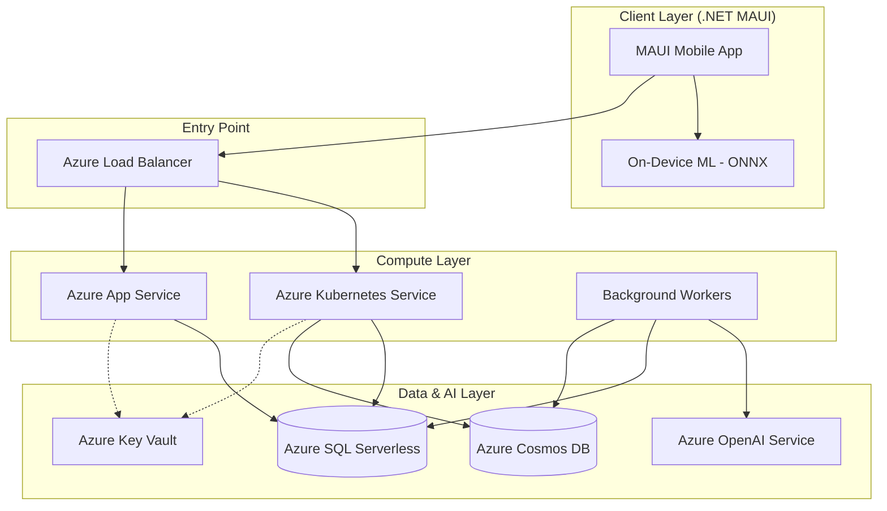

# Azure Deployment Strategy for CryptoCompanion

This document provides a detailed breakdown of the Azure infrastructure, deployment model, and non-functional requirements for the CryptoCompanion project, specifically refined for **Project Review II & III**.

---

## 1. Azure Deployment Strategy – Detailed

| Category | Detail |
| :--- | :--- |
| **Architecture Model** | **Hybrid Cloud Model**: Public Cloud (Microsoft Azure).   **Service Model**: Container Orchestration (AKS) + PaaS (App Service, SQL DB, Cosmos DB). |
| **Hosting Region** | **Primary**: East US (for OpenAI & AKS availability).   **Secondary**: Sweden Central (Specific to GenAI workloads). |
| **System Design** | **Production Tier**: Azure Kubernetes Service (AKS) with B2s Nodes.   **Staging/Web Tier**: Azure App Service Linux (Basic B1).   **Data Tier**: Azure SQL Database (Serverless) & Azure Cosmos DB (Serverless). |
| **Reliability** | **High Availability**: AKS replica sets (min 2 pods), Cosmos DB multi-region readiness.   **Disaster Recovery**: SQL DB point-in-time recovery (PITR), Cosmos DB periodic backups. |
| **Security Measures** | **Authentication**: Managed Identity for Service-to-Service communication.   **Encryption**: AES-256 at rest (SQL/Cosmos), TLS 1.3 in transit.   **Secret Management**: Azure Key Vault integration with zero hardcoded keys. |
| **Operational Excellence**| **DevOps**: GitHub Actions for CI/CD.   **Deployment**: Blue-Green deployments via AKS labels and App Service slots.   **Monitoring**: Application Insights for real-time telemetry and error tracking. |
| **Cost Optimization** | **Serverless DBs**: Pay-per-request and auto-pause for SQL/Cosmos.   **Auto-scale**: Horizontal Pod Autoscaler (HPA) in AKS. |

---

## 2. Infrastructure Requirements – Functional

| Feature | Expected Usage | Azure Spec | Scaling Method |
| :--- | :--- | :--- | :--- |
| **Live Crypto Prices** | 24/7 background polls | Azure Kubernetes (Background Pods) | Horizontal scaling via replica count |
| **News & Sentiment** | 100+ articles/day | Cosmos DB (Serverless) | Request Unit (RU) auto-scaling |
| **Portfolio Management**| 1,000+ users | Azure SQL Database (Serverless) | Auto-pause and scale vCores |
| **GenAI Advisor** | 50+ summaries/day | Azure OpenAI (gpt-3.5-turbo) | Tokens-per-minute (TPM) allocation |
| **On-Device ML** | 100+ inferences/day | Client-Side (ONNX Runtime) | Local execution (Zero cloud cost) |

---

## 3. Infrastructure Requirements – Non-Functional (NFR)

| NFR | Metric Target | Azure Configuration | Reasoning |
| :--- | :--- | :--- | :--- |
| **Scalability** | Handle 5x spike | AKS HPA / HScale | Support market volatility events. |
| **Performance** | <150ms API response | AKS Proximity Placement | Fast data delivery for high-frequency updates. |
| **Availability** | 99.9% uptime | AKS Self-healing Pods | Ensure constant access to user portfolios. |
| **Security** | OWASP Top 10 | Azure WAF (Optional) | Protect against injection and unauthorized access. |
| **Automation** | 100% IaC | Terraform | Ensure environment parity across dev/test/prod. |

---

## 4. Azure Services Mapping – Expanded

| Requirement | Azure Service | SKU/Tier | Purpose | Justification | Est. Monthly Cost (₹) |
| :--- | :--- | :--- | :--- | :--- | :--- |
| **API Orchestration** | **AKS** | Standard_B2s | Production Hosting | Industry standard for Docker-based scaling. | 1,200 |
| **Web API Hosting** | **App Service** | Basic B1 | Staging/Web Endpoint | Managed, easy custom domains/SSL. | 1,100 |
| **Relational DB** | **Azure SQL DB** | Serverless vCore | User Data | Scale-to-zero when app is idle. | 800 |
| **NoSQL DB** | **Cosmos DB** | Serverless | News/Sentiment | High-speed reads for unstructured data. | 500 |
| **AI Intelligence** | **Azure OpenAI** | S0 (gpt-3.5) | Market Insights | Best-in-class LLM for financial analysis. | 400 |
| **Secret Management** | **Key Vault** | Standard | API Keys | Secure, auditable secret storage. | 100 |
| **Monitoring** | **App Insights** | Standard | Telemetry | Essential for Review II viva demo. | 300 |
| **CI/CD** | **GitHub Actions**| Free | DevOps Pipeline | Automated builds and deployments. | 0 |
| **Total (Est.)** | | | | | **~4,400** |

---

## 5. High-Level Architecture Diagram

