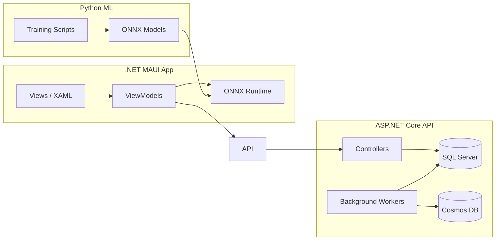

# 🪙 CryptoCompanion

A full-stack, AI-powered cryptocurrency companion app built with **.NET MAUI**, **ASP.NET Core**, and **Python ML**. CryptoCompanion delivers real-time market data, news aggregation, social sentiment analysis, and on-device machine learning predictions — all from a single, cross-platform mobile & desktop application.

---

## ✨ Features

| Feature | Description |
|---|---|
| **Smart Suggestions** | ML-driven investment suggestions powered by on-device ONNX models |
| **Live Market Data** | Real-time prices, market cap, and 24h changes for the top 20 cryptocurrencies via CoinGecko |
| **News Feed** | Aggregated crypto news articles with source links and publication dates |
| **Sentiment Analysis** | Social media sentiment tracking to gauge market mood |
| **Portfolio Insights** | Portfolio clustering and grouping using unsupervised ML |
| **Price Alerts** | Configurable alerts for price movements and anomalies |

---

## 🏗️ Architecture

CryptoCompanion is a **three-project solution** following a clean, layered architecture:

```
CryptoCompanion.sln
├── CryptoCompanion/          # .NET MAUI client (UI + on-device ML)
├── CryptoCompanionApi/       # ASP.NET Core Web API (backend)
└── CryptoCompanionML/        # Python ML training pipeline
```



### Client — `CryptoCompanion/`

Cross-platform MAUI app targeting **Android**, **iOS**, **macOS**, and **Windows**.

- **MVVM** architecture using [CommunityToolkit.Mvvm](https://learn.microsoft.com/dotnet/communitytoolkit/mvvm/)
- **On-device ML inference** via [ONNX Runtime](https://onnxruntime.ai/) — no server round-trip needed for predictions
- **5 tabbed pages**: Suggestions · News · Sentiment · Portfolio · Alerts
- Typed HTTP client consuming the backend API

### Backend — `CryptoCompanionApi/`

ASP.NET Core Web API (.NET 10) providing data services.

- **Dual database strategy**:
  - **SQL Server (LocalDB)** — structured relational data (crypto assets, portfolios)
  - **Azure Cosmos DB** — semi-structured data (news articles, social sentiment)
- **Background workers** that poll external APIs on a schedule:
  - `CryptoDataWorker` — fetches market data from [CoinGecko](https://www.coingecko.com/)
  - `NewsDataWorker` — aggregates crypto news
  - `SentimentDataWorker` — collects social sentiment signals
- **REST controllers**: Suggestions, News, Sentiment, Alerts

### ML Pipeline — `CryptoCompanionML/`

Python-based training pipeline that exports models to ONNX format for on-device inference.

| Script | Model | Algorithm |
|---|---|---|
| `train_price_forecast.py` | Price prediction | Regression |
| `train_crypto_ranking.py` | Asset ranking / scoring | Regression |
| `train_portfolio_clustering.py` | Portfolio grouping | K-Means Clustering |
| `train_anomaly_detector.py` | Flash crash / pump & dump detection | Isolation Forest |
| `train_sentiment_classifier.py` | Text sentiment classification | Classification |

---

## 🚀 Getting Started

### Prerequisites

| Tool | Version |
|---|---|
| [.NET SDK](https://dotnet.microsoft.com/download) | 10.0+ |
| [Visual Studio 2022](https://visualstudio.microsoft.com/) | With MAUI workload |
| [Python](https://python.org/) | 3.10+ |
| [SQL Server LocalDB](https://learn.microsoft.com/sql/database-engine/configure-windows/sql-server-express-localdb) | Included with VS |
| [Azure Cosmos DB Emulator](https://learn.microsoft.com/azure/cosmos-db/local-emulator) | Latest |

### 1. Clone the Repository

```bash
git clone https://github.com/Sidharth-Subramonian/CryptoCompanion.git
cd CryptoCompanion
```

### 2. Train ML Models

```bash
cd CryptoCompanionML
pip install -r requirements.txt

python train_price_forecast.py
python train_crypto_ranking.py
python train_portfolio_clustering.py
python train_anomaly_detector.py
python train_sentiment_classifier.py
```

Copy the generated `.onnx` files from `CryptoCompanionML/models/` into `CryptoCompanion/Resources/Raw/`.

### 3. Start the Backend API

1. Ensure **SQL Server LocalDB** is available (ships with Visual Studio).
2. Start the **Azure Cosmos DB Emulator**.
3. Run the API:

```bash
cd CryptoCompanionApi
dotnet run
```

The API will automatically:
- Apply EF Core migrations to LocalDB
- Create the Cosmos DB database and containers
- Start background workers to fetch live data

### 4. Run the MAUI App

Open `CryptoCompanion.sln` in Visual Studio and set **CryptoCompanion** as the startup project. Select your target platform (Android emulator, Windows Machine, etc.) and press **F5**.

Alternatively, from the CLI:

```bash
cd CryptoCompanion
dotnet build -t:Run -f net10.0-windows10.0.19041.0
```

---

## ⚙️ Configuration

Backend settings are in `CryptoCompanionApi/appsettings.json`:

```jsonc
{
  "ConnectionStrings": {
    // SQL Server LocalDB
    "DefaultConnection": "Server=(localdb)\\mssqllocaldb;Database=CryptoCompanion;Trusted_Connection=True;",
    // Cosmos DB Emulator (default well-known key)
    "CosmosDbAccountEndpoint": "https://localhost:8081/",
    "CosmosDbAccountKey": "C2y6yDjf5/R+ob0N8A7Cgv30VRDJIWEHLM+4QDU5DE2nQ9nDuVTqobD4b8mGGyPMbIZnqyMsEcaGQy67XIw/Jw=="
  }
}
```

> [!NOTE]
> The Cosmos DB key shown above is the **well-known emulator key** and is not a secret. For production, replace both connection strings with secure, managed credentials.

---

## 📁 Project Structure

```
CryptoCompanion/
├── Converters/                 # XAML value converters
├── Models/                     # Client-side data models
│   ├── AlertItem.cs
│   ├── CryptoAsset.cs
│   ├── NewsArticle.cs
│   ├── SentimentSummary.cs
│   ├── SocialSentiment.cs
│   └── SuggestionModel.cs
├── Services/
│   ├── Api/                    # Typed HTTP client for backend
│   │   └── BackendApiService.cs
│   └── ML/                     # On-device ONNX inference
│       └── OnnxInferenceService.cs
├── ViewModels/                 # MVVM ViewModels
├── Views/                      # XAML pages
│   ├── SuggestionsPage.xaml
│   ├── NewsPage.xaml
│   ├── SentimentPage.xaml
│   ├── PortfolioPage.xaml
│   └── AlertsPage.xaml
├── MauiProgram.cs              # DI registration & app bootstrap
└── AppShell.xaml               # Shell navigation (TabBar)

CryptoCompanionApi/
├── Controllers/                # REST API endpoints
├── Data/                       # EF Core DbContexts
├── Migrations/                 # EF Core migrations
├── Models/                     # Server-side data models
├── Services/                   # Background data workers
└── Program.cs                  # Service registration & pipeline

CryptoCompanionML/
├── models/                     # Exported .onnx model files
├── train_*.py                  # Training scripts
└── requirements.txt            # Python dependencies
```

---

## 🛠️ Tech Stack

| Layer | Technology |
|---|---|
| **Frontend** | .NET MAUI, XAML, CommunityToolkit.Mvvm |
| **Backend** | ASP.NET Core (.NET 10), Entity Framework Core |
| **Databases** | SQL Server (LocalDB), Azure Cosmos DB |
| **ML Training** | Python, scikit-learn, skl2onnx |
| **ML Inference** | ONNX Runtime (on-device) |
| **External APIs** | CoinGecko (market data) |
| **Cloud Storage** | Azure Blob Storage |

---

## 📄 License

This project is for educational and personal use.
